# RV Analyzer, explained like you're 5

*(Then a little bit like you're 12, then like you're a grown-up. Stop reading whenever you've had enough.)*

---

## The one-minute version

Imagine a game. Somebody hides a picture in a box. You can't open the box. You close your eyes, think
really hard, and draw whatever pops into your head. Then the box opens and you see if your drawing looks
like the picture.

That's it. That's the game. **RV Analyzer is the box, the drawing paper, and the scorekeeper.**

It also has a little hat you can wear (a **Muse headband**) that listens to the tiny electrical
wiggles your brain makes while you play. After the game it draws you a picture of those wiggles.

> **Real talk, even for a 5-year-old:** the app can't tell you if your brain is "psychic." It can only
> keep a very honest diary of how you did. Keep reading to see how it stays honest.

---

## What's a "remote viewing"?

**Remote viewing** (RV) is the name for the guessing game above: trying to describe something you can't
see. Some people practice it for fun, some for curiosity, some because they're skeptics who want to test it.
This app doesn't care which one you are. It just helps you practice and keep score fairly.

## What's the brain hat?

A **Muse** is a headband with little sensors that touch your forehead and behind your ears. Your brain
makes tiny electricity, and the sensors listen. We call that **EEG**. (You don't need one! The app works
without it. It's a bonus.)

Brain wiggles come in different speeds, like different instruments in a band:

| Name | Think of it as | Roughly feels like |
|---|---|---|
| **Delta** | slow drums | deep sleep |
| **Theta** | a gentle cello | daydreaming, drifting |
| **Alpha** | a calm flute | relaxed, eyes closed |
| **Beta** | a busy guitar | thinking hard, focused |
| **Gamma** | a tiny fast triangle | lots of brain teamwork |

The app makes one simple number out of two of them: **Theta minus Beta**. Big number = more daydreamy than
busy. It calls that the **RV index**. It's *a thing to notice*, not a "psychic meter."

---

## How the game works here

```mermaid
flowchart LR
    A[Press Start new target] --> B[App picks a secret picture<br/>and hides it]
    B --> C[You get a secret code number<br/>like 4821-0937]
    C --> D[Optional: put on the headband<br/>press Connect Muse, then Start capture]
    D --> E[Draw and write what you sense<br/>on the whiteboard]
    E --> F[Say how sure you are<br/>0 to 100]
    F --> G{Judging on?}
    G -->|yes| H[Pick which picture you think it was<br/>from a small lineup]
    G -->|no| I
    H --> I[Reveal! See the real picture]
    I --> J[Score yourself and write a note]
    J --> K[See your brain-wiggle graph<br/>and your stats]
```



**The most important rule is the hiding.** The app never shows the picture, the picture's name, or even a
hint until you've finished drawing and said how sure you are. Even your brain-wiggle graph is locked until
the reveal. That's what makes it a fair game and not wishful thinking.

### "Judging" is the honest part

If you turn on judging, after drawing you see a small lineup: the real picture plus one decoy (or up to
three). You pick the one you think matches. With 2 pictures, pure luck gets you it right **half** the time.
So if you keep getting it right *more* than half the time, over a lot of tries, that's interesting. The app
works out how surprising your record is compared with luck (a **p-value**), and it's careful to do the
math correctly even if you changed the number of pictures partway through.

Your own "how well did I match?" score is useful for reflecting, but it's *your opinion*. Judging is the
fair one.

---

## What else is in there?

- **EEG sessions (the "upload" page).** Already record brain wiggles with the Muse Monitor app? Upload the
  file. The app draws a big graph of the whole session, marks the moments that stood out, and shows how
  your sessions change over time. The **trend graph** on the main page also includes the brainwaves you
  recorded inside trials (blue circles = uploads, orange diamonds = trials).
- **AI coach (optional).** If you have your own AI (like Ollama), the app can ask it to write friendly
  feedback about a session. It runs on **your** computer. It is never told what the secret picture was.
- **Settings page.** A page with boxes to type in your AI's address, a photo key, and so on. Everything is
  optional.
- **Guide page.** A built-in glossary that explains every word and graph.
- **Health lights (for the curious grown-ups).** The app can report whether its parts are working to tools
  like Prometheus and Grafana. You don't need any of that to play.

---

## Let's play! (copy-paste steps)

### 1. Get it running

You need [Docker Desktop](https://www.docker.com/products/docker-desktop/) installed. Then open a terminal:

```bash
git clone https://github.com/Bagatron/rv-analyzer.git
cd rv-analyzer
docker compose up -d
```

Open **http://localhost:8000** in your browser. That's the whole install. Your drawings and scores live in
a Docker volume, so they're still there tomorrow.

*(To stop it: `docker compose down`. Your data stays. To update: `docker compose pull && docker compose up -d`.)*

### 2. Play without the headband

1. Click **RV targets**, then **Start new target**.
2. You get a **coordinate** (just a code, like `4821-0937`). Look at it, relax, and let your mind wander.
3. Draw and type whatever comes to you on the whiteboard. Wrong lines don't matter; nobody's grading your art.
4. Slide the **confidence** bar to how sure you are, then press **Submit session**.
5. If judging is on, click your favorite from the lineup and press **Lock in my choice and reveal**.
6. Look at the reveal. Move the score slider, write what you noticed, and press **Save score**.

Do this a bunch of times. The stats page gets more meaningful with more tries. One try tells you nothing.

### 3. Add the brain hat (optional)

1. Use **Chrome or Edge** on a computer or Android phone. (Safari, Firefox and iPhones can't do Bluetooth
   in a web page.)
2. Open the app at **http://localhost:8000**. (`localhost` is allowed to use Bluetooth. If you open it from
   another computer on your network, Chrome blocks Bluetooth unless the page uses HTTPS, see the README.)
3. Turn the Muse on, wear it so the sensors touch your skin, close other Muse apps (the headband can only
   talk to one thing at a time).
4. On the trial page click **Connect Muse**, pick it from the list, and wait until the panel says it's connected.
5. Press **Start capture**, then play as usual. Tap the marker buttons (*Begin viewing*, *Impression*, *Sketching*) as you go so the graph shows what you were doing. Press **Stop** when finished; the recording is attached when you submit.
6. After the reveal, the **Brainwaves** graph appears with a plain-language key on how to read it.

If it disconnects, the page tries to reconnect by itself. A low battery or another app grabbing the
headband are the usual culprits.

### 4. Upload a session you already recorded

1. Go to the main page, pick your Muse Monitor `.csv` or `.xlsx` file, press **Analyze**.
2. Wait a moment. Click the session to see the graph, the "top windows," and the notes.

### 5. Turn on the AI coach (optional)

Open **Settings**, type your AI server's address and model name, save, and press **Test AI connection**. No AI? Skip it. Want a
local one? Run `docker compose --profile ai up -d` and follow the README.

---

## Okay, now like you're a grown-up

**What it is.** A self-hosted FastAPI/Python web app with SQLite on a data volume. Nothing leaves your
machine except two kinds of requests you can see: it downloads target pictures from Wikimedia Commons
(or Pexels, if you add a key), and it talks to the AI server you point it at (if any).

**How the EEG numbers are made.** Raw band power is smoothed, then `Theta − Beta` is computed and
z-scored within the session to give the *RV index*. "Intuitive windows" are simply the highest-scoring
stretches of that index, spaced apart. **They always exist, even in pure noise**, so a "top window"
is not evidence of anything by itself.

**How the blind protocol works.** The target image, its source page, and the decoys are stored server-side
and withheld from the interface and from the AI until the trial is revealed. Trial logs, metrics and traces
deliberately never include the target or its search theme.

**What the stats mean.** Each judged trial has its own chance level (1 over the number of pictures
shown). The app computes the exact probability of doing at least as well as you did by luck alone, across
all your judged trials, even when the lineup size changed over time. That number is the only accuracy
evidence in the app. Self-scores and EEG graphs are for reflection, not proof.

**What it can't do.** Brainwave band power can't tell whether a viewing was correct. This is a practice
and record-keeping tool. Treat patterns you notice as questions to test with more trials, not answers.

**Where to go next.** The [README](../README.md) covers configuration, Kubernetes, the Settings page,
the optional Prometheus/Grafana/Tempo profile, and development. The app's own **Guide** page
(`/guide`) has the full legend.
